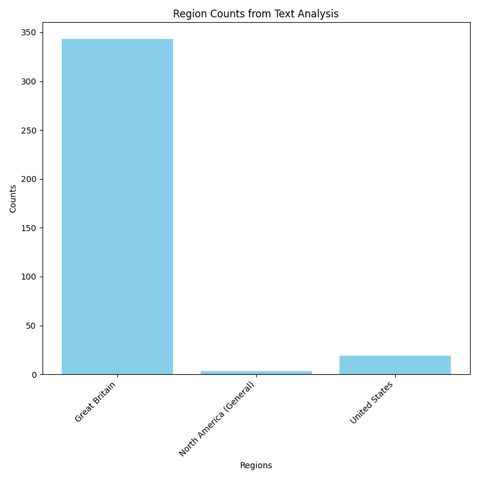

# English Regional Lexicon Detector

## Overview
This project builds a regional English lexicon database and detects
regional characteristics (British, North American, etc.) in English texts from Wikipedia articles or local TXT/PDF files using NLP techniques.

## Features
- Manually curated raw data based on reliable websites and dictionaries (continuously expanding)
- Raw lexicon data stored and maintained in CSV format
- CSV → categorized JSON lexicon conversion
- Wikipedia articles and local TXT/PDF file analysis
- Automatically runs OCR when text extraction from PDF files fails
- Inflection, phrasal, and root-based matching
- Lemmatization using spaCy, available up to 2 million characters by configuring `nlp.max_length`
- The visualization is automatically generated using Matplotlib and saved as an image file during execution.

## Setup
```bash
pip install -r requirements.txt
```

## Usage
python main.py

## Additional Information
Fetching full articles from Wikipedia may take longer than loading local TXT or PDF files due to API access and network latency.

### Sample Analysis: *Pride and Prejudice*

The analysis of *Pride and Prejudice* shows a strong dominance of British English features.

- British English: 343
- North American (General): 3
- United States: 19
- Total detected regional features: 365

This result is consistent with the fact that the novel was written by a British author in the early 19th century.



## Notes
This project is designed with extensibility in mind and can be adapted to web applications or database-backed workflows.